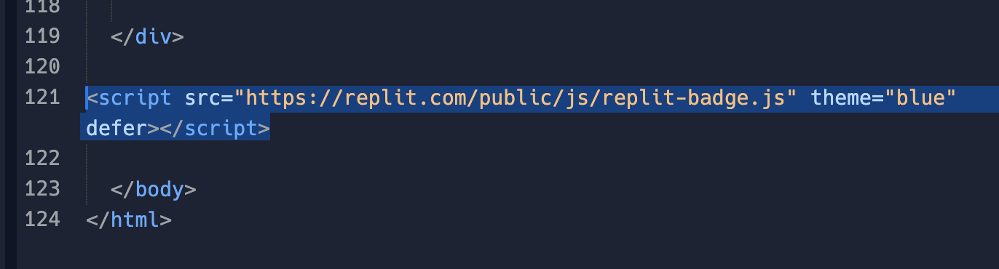
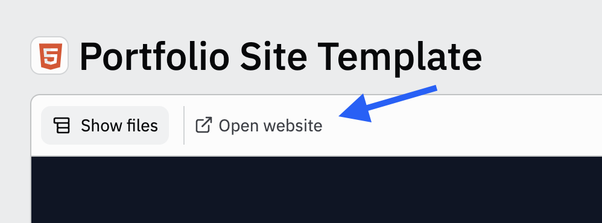
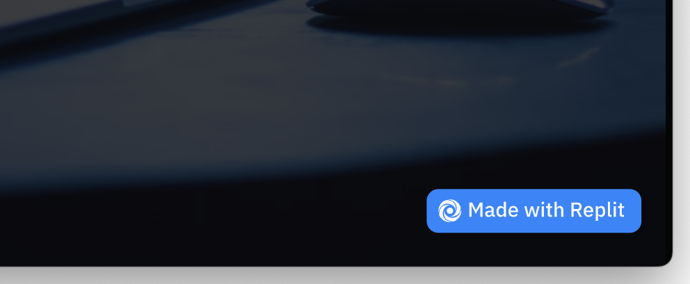
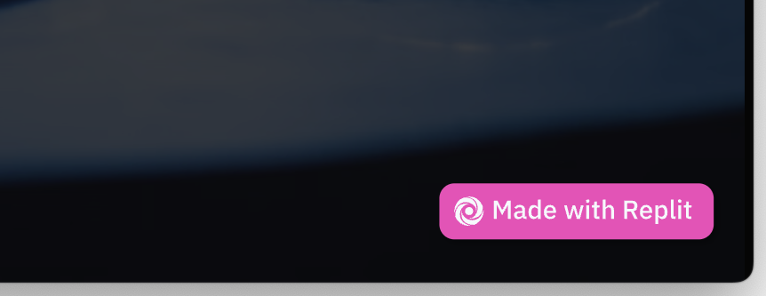

# Add a Made with Replit badge to your Webview

Now you can add a "Made with Replit" badge to your public Repl's webview.

The badge will link back to your Repl's cover page so that visitors can learn more about your creations.

## What is the Webview?

The webview is the view of your repl that users see when they click "Open website" of a public Repl.

The webview appears full-screen in its own browser window, and has the following URL format:

`https://{your-repl-name}.{your-user-name}.repl.co/`

## How to add the badge

The badge can be added to any repl with an index page serving HTML.

1. Go to your Repl's file browser and find `index.html`
2. Add the following code before the closing `</body>` tag:

```html
<script src="https://replit.com/public/js/replit-badge.js" theme="blue" defer></script>
```
### Example


## Test your badge

1. Run your Repl, then click "Open website"

2. Your badge should appear in the lower right
3. Click your badge to get back to the Repl's cover page



## Changing the color theme

You can change the color of your badge by replacing `theme="blue"` with any color from this list:

`dark, light, red, orange, yellow, lime, green, teal, blue, blurple, magenta, pink`

### Example
```html
<script src="https://replit.com/public/js/replit-badge.js" theme="pink" defer></script>
```


## How to remove the badge

If the badge was already a part of your template and you would like to remove it, simply delete this code from `index.html`

Delete this code:
```html
<script src="https://replit.com/public/js/replit-badge.js" theme="blue" defer></script>
```


